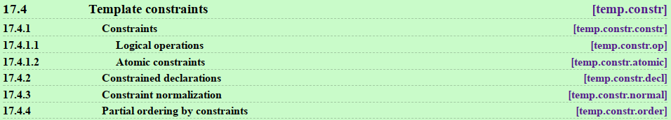
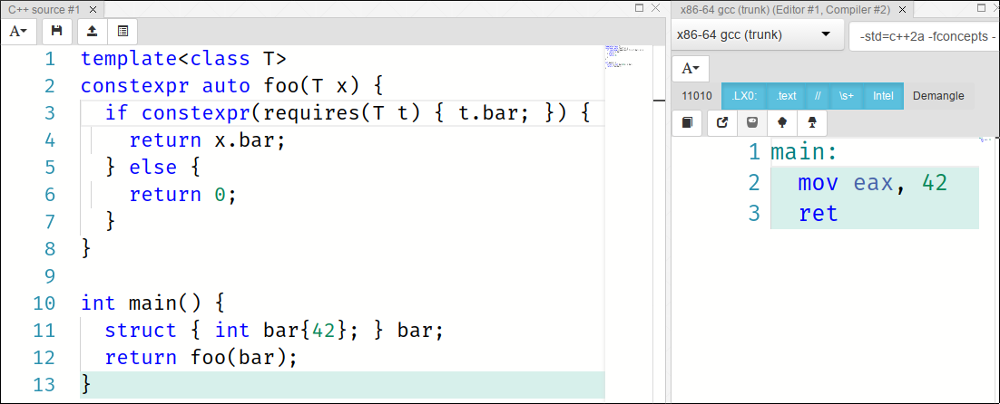
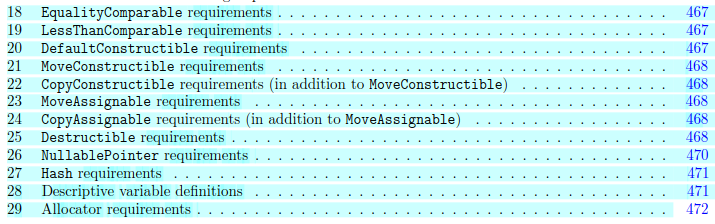

<!-- story how concepts were removed from C++0x  -->

<!-- footer:  kris@jusiak.net | @krisjusiak | linkedin.com/in/kris-jusiak -->

Meeting C++ 2017

# Concepts Driven Design

<hr />

##### Kris Jusiak, Quantlab Financial

---

<!-- footer: Meeting C++ 2017 | Concepts Driven Design | Kris Jusiak -->

# Overview

<font size="5">
  
* Concepts
  * Motivation / History
* Type constraints (C++20)
  * Requirements
    * Design by introspection
  * Named `concepts`
  	* Optional interfaces
* Concepts emulation (C++17)
* Concepts based design
  * Static polymorphism
  * Dynamic polymorphism
    * Virtual concepts (C++2?)
  * Dependency Injection
  * Mocking (testing)
* Future of concepts (C++2X)

</font>

---

# Disclaimer

> This talk is from user perspective
> See Andrew Sutton talks for more details about concepts!

> Concepts, although, merged into C++20 draft, are still a subject for future changes.

| Compiler | Version | Notes |
| - | - | - |
| GCC | 6.1+ | Requires `-fconcepts` flag |
| MSVC | VS2017 15.5 | - |
| Clang | In progress... | - |

> Examples in this talk were compiled using
> `g++7.2 -std=c++2a -fconcepts`

---

<!-- page_number: true -->

# Motivation - Well Specified Interfaces

```cpp
template<class T>
const T& min(const T& a, const T& b) {
  return b < a ? b : a;
}
```

> Precise documentation

> * What's are the syntax requirements of `T`?
>	* compile-time - ___**concepts**___
    
> * What's are the semantics requirements for `min`?
>	* run-time - contracts, tests, manuals

---

# Motivation - Error Novel

```cpp
int main() {
  auto list = std::list{1, 2, 3};
  std::sort(std::begin(list), std::end(list));
}
```

https://godbolt.org/g/RTRgg2

---

# Motivation - Compiler diagnostics

> Without concepts
```cpp
 invalid operands to binary expression 
   ('std::_List_iterator<int>' and 
    'std::_List_iterator<int>')
 std::__lg(__last - __first) * 2);
           ~~~~~~ ^ ~~~~~~~
...many lines of templates instantiation call stack...
```

> With concepts
```cpp
error: cannot call std::sort
 note: concept RandomAccessIterator was not satisfied
since: expression (b-a) will be ill formed
```

> Note: Constraints are checked at the point of use

---

# History


> Requirements analysis
> Concepts Lite - https://wg21.link/n3701 
> Concepts TS - https://wg21.link/P0734R0

> Bjarne Stroustrup, Andrew Sutton, Gabriel Dos Reis
> Alex Stepanow, Andrew Lumsdaine, Sean Parent, ...

---

# C++20 draft

http://eel.is/c++draft/temp.constr



* Requirements
  * `requires-clause`, `requires-expression`
* Constraints
  * `predicates, conjunctions, disjunctions`
* Named concepts
  * `placeholders`, `abbreviated templates`

---

# Requirements

---

# `Requires-clause`
> Specifies constraints on template arguments or on a function declaration
> `std::enable_if` on steroids

```cpp
template<bool Value>
void foo() requires Value {}
```

```cpp
int main() {
  foo<true>();  // Okay
  foo<false>(); // Error: constraints not satisfied
}
```

> Note: requires-clause is part of the function signature

---

# `Requires-expression`
> prvalue expression of type bool
  `requires ( [parameters] ) { requirements }		`

```cpp
requires(T) { // type requirement
  typename T::value_type;  };
```

```cpp
requires(T t) { // simple requirement
  t[typename T::value_type{}]; };
```

```cpp
requires(T t) { // compound requirement
  { t.empty() } -> bool; }; // convertible to bool
```

```cpp
requires(T t) { // nested requirement
  requires std::is_enum_v<typename T::value_type>; };
```

> Note: Parameters -> `declvals`

---

# `Requires-clause/Requires-expression`

```cpp
template<class T>
constexpr auto foo(T&& x)
  requires requires(T t) { t.bar(); }
{ return x.bar(); }
```

```cpp
  struct { void bar() {} } bar;
  foo(bar); // Okay
  foo(42);  // Error: constraints not satisfied
            //  note: the required expression 
            //        't.bar()' would be ill-formed
```

> Note: `requires requires`  -> `requires-clause` followed by `requires-expression`

---

# Design by introspection

[](https://www.youtube.com/watch?v=29h6jGtZD-U)

https://www.youtube.com/watch?v=29h6jGtZD-U

---

# Design by introspection - D lang

> https://dlang.org/spec/traits.html

```d
auto foo(T)(T x) {
  static if(__traits(hasMember, x, "bar")) {
    return x.bar;
  } else {
    return 0;
  }
}

void main() {
  assert(0 == foo(42));
  
  struct Bar { int bar = 42; }
  Bar bar;
  assert(42 == foo(bar));
}
```

https://godbolt.org/g/wpLXzV

---

# Design by introspection - C++20

```cpp
template<class T>
constexpr auto foo(T x) {
  if constexpr(requires(T t) { t.bar; }) { // SFINAE
    return x.bar;                          // context
  } else {
    return 0;
  }
}

int main() {
  assert(0 == foo(42));
  
  struct { int bar{42}; } bar;
  assert(42 == foo(bar));
}
```

https://godbolt.org/g/uot6Bv

---

# Design by introspection - C++

[](https://godbolt.org/g/MFxqWu)

https://godbolt.org/g/MFxqWu

---

# `Requires`

> Readability?

```cpp
template<class T>
auto bar(T& t) 
  requires requires(T t) {           
    typename T::type;      
    { t.foo() } -> void;  
    requires Movable<T> or Same<T, int>;
  } {
  return t.foo();
}
```

---

# `Named concepts`

---

# `Named concepts`

> A collection of requirements on a type (variable template)

```cpp
template<template-parameters>
concept concept-name = constraint-expression;
```

> "If you like it then you should have put a name on it", Beyonce rule

---

# `Named concepts`

> Predicate constraints

```cpp
template<class>
concept Always = true; // always satisified
```

```cpp
template<class T>
concept Size32 = sizeof(T) == 4;
```

> Conjunctions, Disjunctions
```cpp
template<class T>
concept SignedIntegral = std::is_integral<T>{} and
                         std::is_signed<T>{};
```

---

# `Named concepts`

> Requirements

```cpp
template<class T>
concept Fooable =           // named concept
  requires(T t) {           // collection of
    typename T::type;       //   type requirement
    { t.foo() } -> void;    //   compound requirement
    requires Movable<T> or  //   nested requirement
             Same<T, int>;  
  };
```

> Note: Concepts are never instantiatied 
> (therefore the concept keyword)

---

# `Named concepts`

> 

> Unconstrained class definition
```cpp
template<class> class Bar {};
```

> Requires expression (Long form)
```cpp
template<class T> requires Fooable<T>;
class Bar { };
```

> Abbreviated templates
```cpp
template<Fooable T>
class Bar {};
```

> Note: C++17 - Non-type template arguments
```cpp
template<auto T> class Bar {}; // For values -> Bar<42>
```

---

# `Named concepts`

> Example

```cpp
struct tcp_socket { void send(std::string_view); };
struct udp_socket { void send(std::string_view); };
struct file       { void write(std::string_view); };
```

>  Everything Cpp 
>  https://www.youtube.com/watch?v=xsSYPD0v5Mg

---

# `Named concepts`

> Concept definition

```cpp
template<class T> concept Socket = 
  requires(T t, std:string_view data) {
    { t.send(data) } -> void; // compound requirement
};
```

```cpp
template<class T> concept File = 
  requires(T t, std:string_view data) {
    { t.write(data) } -> void; // compound requirement
};
```

---

# `Named concepts`

> Concept overloading

```cpp
template<Socket T> // requires Socket<T>
/*1*/ void forward(T& t, std::string_view data) {
  t.send(data);
}
template<File T> // requires File<T>
/*2*/ void forward(T& t, std::string_view data) {
  t.write(data);
}
```

```cpp
int main() {
 tcp_socket tcp; forward(tcp, "tcp data"sv); // calls 1
 udp_socket udp; forward(udp, "udp data"sv); // calls 1
 file file; forward(file, "file data"sv);    // calls 2
}
```

> Note: If multiple are satisifed the most constrainted is chosen

---

# `Named concepts`

> Concepts overloading
> `if constexpr` (C++17)

```cpp
template<class T>
void forward(T& t, std::string_view data) {
  if constexpr(Socket<T>) { // compile-time
    t.send(data);
  } else if constexpr(File<T>) {
    t.write(data);
  }
}
```

> Note: Branch which is not taken is discarded
> --------- Statement may not compile but syntax has to be valid

---

# `Named concepts`

> `Lambdas`

```cpp
constexpr auto forward = 
  [](auto& t, std::string_view data) {
    using type = std::decay_t<decltype(t)>>;
    if constexpr(Socket<type>) { t.send(data);  } else 
    if constexpr(File<type>)   { t.write(data); }
  };
```

> `Generic lambdas` (C++17) - https://wg21.link/P0428r2

```cpp
constexpr auto forward = 
  []<class T>(T& t, std::string_view data) {
    if constexpr(Socket<T>) { t.send(data);  } else 
    if constexpr(File<T>)   { t.write(data); }
  };
```

---

# `Named concepts`
> Optional interfaces

Example -> `Stream<T>`
* Copy constructible
* Callable member function `write` which takes type `T&`
* Callable member function`read` which returns type `T`
* Callable **optional** member function `read_complete`
* Printable

---

# `Named concepts`
> Optional interfaces : Virtual functions (not expressive enough)
```cpp
/**
 * Implementation requires to be printable and 
 * copy constructible
 */
template<class T>
class istream {
public:
  virtual ~istream() noexcept = default;
  virtual void write(T&) = 0;
  virtual T read() = 0;
  
  // ??? [[optional]] ???
  virtual void read_complete() = 0;
};
```

---

# `Named concepts`
> Optional interfaces : Concepts

```cpp
template<class T, class TData>
concept Streamable =
  CopyConstructible<T> and      // CopyConstructible
  requires(T t, std::ostream& out, TData& data) {
    out << t;           	// Printable
    t.write(data);      	// Writable
    { t.read() } -> TData  	// Readable
  } or requires(T t, std::ostream& out, TData& data) {
    out << t;           	// Printable
    t.write(data);      	// Writable
    { t.read() } -> TData  	// Readable 1/2
    t.read_complete();  	// Readable 2/2
  }
};
```

---

# `Named concepts`
> Optional interfaces : Usage
```cpp
using data_t = std::array<std::byte, 1024>;
```
```cpp
class FileStream {
public:
  void write(data_t&);
  data_t read();
  void read_complete();
};
```
```cpp
int main() {
  Streamable<data_t> stream = FileStream{};
  const auto data = stream.read();
  ...
  stream.read_complete();
}
```
---

# Placeholders

| Placeholder | Synopsis |
|-|-|
|Unconstrained|`auto`|
|Constrained|`concept-name<[template-argument-list]>`|

```cpp
template<class T> class Foo {};
template<class T> concept Fooable = true;
```

```cpp
// auto - least constrained concept
auto    foo1 = Foo<int>{};
// C++17 - Constructor Template Argument Deduction
Foo     foo2 = Foo<int>{};
// C++20 - placeholder
Fooable foo3 = Foo<int>{};
```

> Note: Placeholders can be used for functions `void f(auto);`

---

# Concepts and the C++ ISO standard
<center>
  


</center>

> Note: More concepts to come with Ranges TS

---

# Concepts and the C++ ISO standard

<center>
  


</center>

```cpp
template<class T> // C++20 concepts
concept EqualityComparable = requires(T a, T b) {
  { a == b } -> bool;
};
```

```haskell
class EqualityComparable a where // Haskell typeclasses
  (==) :: a -> a -> Bool
```

---

# Concepts - Ranges TS

```cpp
template <class I>
concept InputIterator =
  Iterator<I> &&
  Readable<I> &&
  requires(I& i, const I& ci) {
      typename iterator_category_t<I>;
      DerivedFrom<
        iterator_category_t<I>, input_iterator_tag>;
      i++;
  };
```

https://github.com/CaseyCarter/cmcstl2

---

# Concepts emulation (C++17)

---

# Concepts emulation (C++17)

> Substituation Failure Is Not An Error (SFINAE)

```cpp
template<bool, class = void>
struct enable_if {}; // no type alias
 
template<class T>
struct enable_if<true, T> { using type = T; };
```

* `false` predicates lead to ill-formed code that's discarded

---

# Concepts emulation (C++17)

> Dedection idiom (C++20)

```cpp
template<class T>
using Fooable = decltype(std::declval<T&>().foo());
```

```cpp
struct Foo { void foo(); };
struct Bar { };
```

```cpp
static_assert(not std::is_detected<Fooable, Bar>{});
static_assert(    std::is_detected<Fooable, Foo>{});
```

> Note: Under the hood, it uses 
> `template<class...> using void_t = void;`
  
https://wg21.link/n4436

---

# Concepts emulation (C++17)

> Does the Concepts TS Improve on C++17?

```cpp
template <class F, class... Args, class =  decltype(
  std::declval<F&&>()(std::declval<Args&&>()...))>
constexpr auto requires_impl(int) { return true; }

template <class F, class... Args>
constexpr auto requires_impl(...) { return false; }

template <class... Args, class F>
constexpr auto requires(F&&) {
  return requires_impl<F&&, Args&&...>(int{});
}
```

https://wg21.link/P0726R0

---

# Concepts emulation (C++17)

> `requires-clause`

```cpp
struct Foo { void foo(); };
struct Bar {};
```

```cpp
static_assert(
  requires<Foo>([](auto&& t) -> decltype(t.foo()) {})
);

static_assert(
  !requires<Bar>([](auto&& t) -> decltype(t.foo()) {})
);
```

---

# Concepts emulation (C++17)

> Design by introspection - C++17

```cpp
template<class T> constexpr auto foo(T x) {
  if constexpr(requires<T>( // compile-time if
   [](auto&& t) -> decltype(t.bar) {})) {
    return x.bar; 
   } else { 
    return 0; 
  }
}
```

> Note: Workaround for expression is not a constant expression
```cpp
 if constexpr(
   auto bar = [](auto&& t) -> decltype(t.bar) {}; 
   requires<T>(bar)
 )
```

---

# Concepts emulation (C++17)

> `Named concept`

```cpp
template<class T> constexpr auto Socket = 
  requires<T>([](auto&& t, std:string_view data)-> 
    decltype(t.send(data)) {}
  );
```

```cpp
template<class T> constexpr auto File = 
  requires<T>([](auto&& t, std:string_view data) -> 
    decltype(t.write(data)) {}
  );
```
---

# Concepts emulation (C++17)

> Error message

```cpp
template<class T, class = std::enable_if_t<Socket<T>>
void forward(T& t, std::string_view data) {
  t.send(data);
}
```

```cpp
int main() {
  tcp_socket tcp; forward(tcp, "tcp data"sv); // Okay
  file file; forward(file, "file data"sv);
   // error: no matching function for call to 'forward'
   // possibly many lines of output <- library side
}
```

> Note: No details why function couldn't be called

---

# Concepts emulation (C++17)

> Concepts overloading

```cpp
template<class T, 
  std::enable_if_t<Socket<T>, int> = 0>
/*1*/ void forward(T& t, std::string_view data) {
  t.send(data);
}

template<class T, 
  std::enable_if_t<File<T>, int> = 0>
/*2*/ void forward(T& t, std::string_view data) {
  t.write(data);
}
```

```cpp
int main() {
 tcp_socket tcp; forward(tcp, "tcp data"sv); // calls 1
 udp_socket udp; forward(udp, "udp data"sv); // calls 1
 file file; forward(file, "file data"sv);    // calls 2
}
```

---

# Concepts emulation (C++17)

> Concept overloading
> `if constexpr` (C++17)

```cpp
template<class T>
void forward(T& t, std::string_view data) {
  if constexpr(Socket<T>) { // compile-time
    t.send(data);
  } else if constexpr(File<T>) {
    t.write(data);
  }
}
```

> Note: Exactly the same way as with C++20 concepts

---

# Concepts based design

---

# Concepts based design

> Goals

| | |
|-|-|
| Expressiveness | Type constraints for better error messages (Design by Introspection) |
| Loosely coupeled design | Inject all the things! (Policy Design) |
| Performance | Static dispatch by default <br />(based on concepts) |
| Flexiblity | Dynamic dispatch using type erasure (based on the same concepts) |
| Testability | Automatic mocks injection <br />(based on the same concepts) |

---

# Concepts based design
> Static polymorphism

```cpp
template<class T> concept Drawable =  requires
 (T t, std::ostream& out) { { t.draw(out) } -> void; };
```
  
```cpp
struct Square {
  void draw(std::ostream& out) { out << "Square"; } };

struct Circle {
  void draw(std::ostream& out) { out << "Circle"; } };

template<Drawable T>
void f(T& d) { d.draw(std::cout); }

int main() {
  f(Square{}); // prints Square
  f(Circle{}); // prints Circle
}
```

---

# Concepts based design
> Static polymorphism

```cpp
std::vector v1 = { Square{}, Circle{} };
 // ERROR: class template argument deduction failed
 
std::vector<auto> v2 = { Square{}, Circle{} };
 // ERROR: couldn't deduce template parameter
 
std::vector<Drawable> v3 = { Square{}, Circle{} }; 
 // ERROR: couldn't deduce template parameter
```

---

# Concepts based design
> Concepts based polymorphism / Dynamic polymorphism

[](https://channel9.msdn.com/Events/GoingNative/2013/Inheritance-Is-The-Base-Class-of-Evil)
[Inheritance-Is-The-Base-Class-of-Evil](https://channel9.msdn.com/Events/GoingNative/2013/Inheritance-Is-The-Base-Class-of-Evil)

---

# Concepts based design
> Dynamic polymorphism / type erasure

```cpp
class Drawable {
  void* ptr_{}; // ??? Small Buffer Optimization (SBO)
  struct {
    void (*draw)(std::ostream&);
    void (*delete_ptr)(void*);
  } const* const vptr_{};
  
public:
 template<class T> Drawable(T t) // non explicit
  : ptr_{new T{t}}, vptr_{
    [](void* self) { static_cast<T*>(self)->draw(); },
    [](void* self) { delete static_cast<T*>(self); } } 
 { }
 ~Drawable() { vptr_->delete_ptr(ptr_); }
  
 void draw(std::ostream& os) { vptr_->draw(os); }
};
```

---

# Concepts based design
> Dynamic polymorphism / Virtual concepts (C++2?)

```cpp
template<class T> concept Drawable =
  requires() { auto T::draw(std::ostream&) -> void; };
            // Signature requirement
```
  
```cpp
struct Square {
  void draw(std::ostream& out) { out << "Square"; } };

struct Circle {
  void draw(std::ostream& out) { out << "Circle"; } };

void f(virtual Drawable& d) { d.draw(std::cout); }
    // Type erasure

int main() {
  f(Square{}); // prints Square
  f(Circle{}); // prints Circle
}
```

---

# Concepts based design
> Dynamic polymorphism / Virtual concepts (C++2?)

> Signature requirement
```cpp
template<class T>
concept Fooable = requires() {
  auto T::foo() -> void; // NOT C++20!
};
```

[Dynamic Generic Programming with Virtual Concepts](https://github.com/andyprowl/virtual-concepts/blob/master/draft/Dynamic%20Generic%20Programming%20with%20Virtual%20Concepts.pdf)

> Note: Virtual concepts aren't part of C++20

---

# Concepts based design
> Dynamic polymorphism / Virtual concepts (C++2?)

```cpp
std::vector<virtual Drawable> v; // Okay (type erasure)
v.push_back(Square{});           // Okay
v.push_back(Circle{});           // Okay
```

> 100% value semantics / Stack based / Small buffer optimization (SBO)

> Note: Might be also generated with Metaclasses (C++2?)

```cpp
template<class T>           template<class T>
any Foo                     $any { // metaclass
  auto foo() -> void;         constexpr { ... }
};                          };
```

> https://wg21.link/p0707r0

---

# Concepts based design
> Dynamic polymorphism / Virtual concepts emulation (C++17)

```cpp
template<class T> constexpr auto Drawable =
  Callable<void(T::*)(std::ostream&)>( $((draw)) );
```
  
```cpp
struct Square {
  void draw(std::ostream& out) { out << "Square"; } };

struct Circle {
  void draw(std::ostream& out) { out << "Circle"; } };

void f(any<$(Drawable)>& d) { d.draw(std::cout); }

int main() {
  f(Square{}); // prints Square
  f(Circle{}); // prints Circle
}
```

---

# Concepts based design
> Virtual concepts emulation (C++17)

```cpp
Callable<void(T::*)(std::ostream&)>( $((draw)) ]    
          \_  \________     \________    \___-> name
            \          \             \              
$((name)) [](auto&& r, auto&& t, auto&&... args) {
 struct { // base class
  auto name(decltype(args)... args)  -> 
    decltype(self.name(args...)){} {
   // static polymorphism (CRTP)
   return static_cast<decltype(t) *>(this)->template 
     call<name, typename decltype(r)::type>(args...);
  }
 } _; return _;
}
```

```cpp
$(type) decltype(type<...>)
```

https://github.com/boost-experimental/vc

---

# Concepts based design
> Dependency Injection (`policy design`) / `concepts`

```cpp
template<class T>
concept ErrorPolicy =
  requires(T t, std::string_view msg) {
    requires CopyConstructible<T>;
    { t.onError(msg) } -> void;
};
```

```cpp
struct ThrowPolicy {
  void onError(std::string_view msg) { throw T{msg}; }
};

struct LogPolicy {
  void onError(std::string_view msg) { 
    std::clog << T{msg} << '\n';
  }
};
```

---

# Concepts based design
> Dependency Injection (`policy design`) / `concepts`

```cpp
template<ErrorPolicy TPolicy = class Policy> // inject
struct App {
  TPolicy policy{};
  void run() { if (...) { policy.onError("error!"); } }
};
```

> Bindings / Injection

```cpp
Creatable injector = di::injector{
  di::bind<class Policy>.to<ThrowPolicy>()
};
injector.create<App>().run();
```

> Same as...

```
App{ThrowPolicy{}}.run();
```

---

# Concepts based design
> Dependency Injection (`policy design`) / `virtual concepts (C++2?)`

```cpp
class App {
public: 
 explicit App(virtual ErrorPolicy policy) 
  : policy{policy}
 { }
 
  void run() {
    if (...) { policy.onError("error!"); }
  }
  
private: 
 virtual ErrorPolicy policy{};
};
```

---

# Concepts based design
> Dependency Injection (`policy design`) / `virtual concepts (C++2?)`

```cpp
Creatable injector = di::make_injector(
  di::bind<virtual ErrorPolicy>.to<LogPolicy>()
);
injector.create<App>().run();
```

> Same as...

```cpp
App{LogPolicy{}}.run();
```

https://github.com/boost-experimental/di

---

# Concepts based design
> Dependency Injection (`policy design`) / `virtual concepts emulation (C++17)`

```cpp
template<class T>
constexpr auto ErrorPolicy = 
  CopyConstructible<T> and
  Callable<void(T::*)()>( $((onError)) ); // expose
```

```cpp
struct App {
  any<$(ErrorPolicy)> policy{};
  void run() { if (...) { policy.onError("error!"); } }
};
```

---

# Concepts based design
> Dependency Injection (`policy design`)  / `virtual concepts emulation (C++17)`

```cpp
Creatable injector = di::make_injector(
  di::bind<$(ErrorPolicy)>.to<LogPolicy>()
);
injector.create<App>().run();
```

> Same as...

```cpp
App{LogPolicy{}}.run();
```

> Note: Same wiring for static/dynamic polymorphism

---

# Concepts based design
> Mocking (testing)

> Interface based mocking
```cpp
struct ErrorPolicy {
 virtual ~ErrorPolicy() = default;
 virtual void onError(std::string_view) = 0;
};
GMock<ErrorPolicy> mock{};
EXPECT_CALL(mock, onError("interface!")).Times(1);
mock.onError("interface!");
```

> Concepts based mocking
```cpp
GMock<$(ErrorPolicy)> mock{};
EXPECT_CALL(mock, onError("concept!")).Times(1);
object(mock).onError("concept!");
```

---

# Concepts based design
> Mocking (testing)

> `automatic mocks injection`
```cpp
"should print read text"_test = [] {
 auto [app, mocks] = testing::make<App>();

 EXPECT_CALL(mocks<$(ErrorPolicy)>, onError("error!"));

 app.run();
};
```

> Note: `make` creates mocks based on concepts requirements (reflection)

https://github.com/cpp-testing/gunit

---

# Future of concepts (C++2X)

---

# Future of concepts (C++2X)

> Terse template syntax

```cpp
void forward(Socket& socket, std::string_view data);
```

> long form

```cpp
template<Socket T>
void forward(T& socket, std::string_view data);
```

> longer form

```cpp
template<class T> requires Socket<T>
void forward(T& socket, std::string_view data);
```

---

# Future of concepts (C++2X)

> Terse template syntax - https://wg21.link/p0696r1

```cpp
void forward(Socket, Socket);
```

> long form

```cpp
template<class T>
void forward(T, T);
```

> **vs**

```cpp
void forward(auto, auto);
```

> long form

```cpp
template<class T, class U>
void forward(T, U);
```

---

# Future of concepts (C++2X)

> Template-introduction syntax

```cpp
Socket{T} void forward(T, auto);
```

> **or**

```cpp
template<Socket [T]> void forward(T, auto);
```

> long form

```cpp
template<class T, class U>
void forward(T, U) requires Socket<T>;
```

---

# Future of concepts (C++2X)

```cpp
template<class T>
struct tcp_socket { 
  static_assert(Socket<tcp_socket>); 
  // always fail, tcp_socket is incomplete
};
```

> Metaclasses syntax

```cpp
template<class T>
Socket tcp_socket { };
```

https://wg21.link/p0707r0

---

<!-- page_number: false -->

# Concepts: Summary

> Provides better diagnostics

> Simplify usage of SFINAE / enable_if
> * Introspection by design / Optional interfaces

> Allows better design

> Can be emulated in C++14/C++17
> * `variable templates`/`constexpr`/`constexpr if`

> C++20 is just the beginning
> * `syntax improvements`/`requirements improvements`
> * `virtual concepts`/`metaclasses`/`static reflection`

---

## Questions?

|   |   |
| - | - |
| **Concepts**         | https://wg21.link/P0734R0  | 
| **Virtual Concepts** |  https://github.com/andyprowl/virtual-concepts/blob/master/draft/Dynamic%20Generic%20Programming%20with%20Virtual%20Concepts.pdf | 

<!-- footer:  kris@jusiak.net | @krisjusiak | linkedin.com/in/kris-jusiak -->