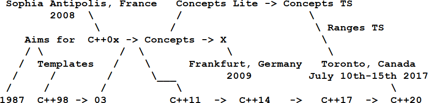
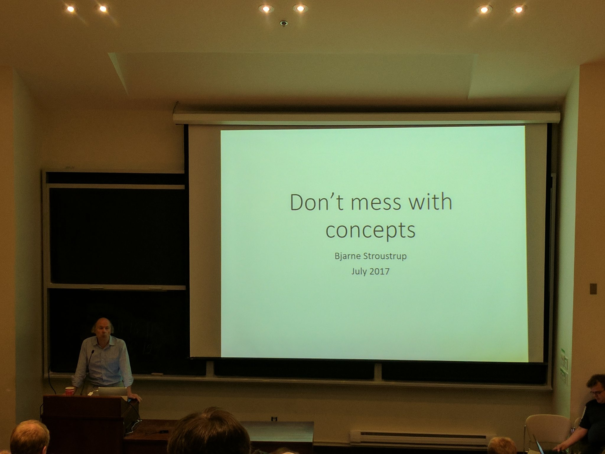
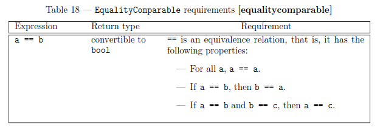
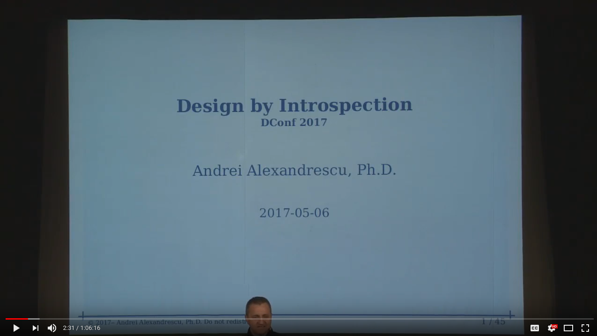

<!-- footer:  kris@jusiak.net | @krisjusiak | linkedin.com/in/kris-jusiak -->

Meeting C++ 2017

# Concepts Driven Design

<hr />

##### Kris Jusiak, Quantlab


---

<!-- story how concepts were removed from C++0x  -->

<!-- footer: Meeting C++ 2017 | Concepts Driven Design | Kris Jusiak -->

# Agenda

* Motivation
* Solution
* Concepts

---

## Disclaimer

All presented examples compiles with GCC-trunk (7.2).

C++20 is still open for alterations.

---

<!-- page_number: true -->

## History



---

## Summer ISO C++ Meeting in Toronto, Canada (July 10th - 15th 2017)

<center>
  


Concepts TS was merged into draft C++20! https://wg21.link/P0734R0

</center>

---
 
## Requirements in the ISO C++ standard
<center>
  


</center>

```
template<class T>
concept EqualityComparable = requires(T a, T b) {
  { a == b } -> bool;
};
```

---

Placeholders

```cpp
void foo() -> requires false;
void foo() -> requires true;
void foo() -> requires Endian == Litle;
```

---

## Concepts - Real life example - Ranges TS

```cpp
template <class I>
concept InputIterator =
  Iterator<I> &&
  Readable<I> &&
  requires(I& i, const I& ci) {
      typename iterator_category_t<I>;
      DerivedFrom<
        iterator_category_t<I>, input_iterator_tag>;
      i++;
  };
```

https://github.com/CaseyCarter/cmcstl2

---

Virtual concepts?

---

## Syntax

terse template notation

3/5

---

## Does the Concepts TS Improve on C++17?

https://wg21.link/P0726R0

```cpp
template <class F, class... Args, class =  decltype(
  std::declval<F&&>()(std::declval<Args&&>()...))>
constexpr auto requires_impl(int) { return true; }

template <class F, class... Args>
constexpr auto requires_impl(...) { return false; }

template <class... Args, class F>
constexpr auto requires(F&&) {
  return requires_impl<F&&, Args&&...>(int{});
}
```

---

Concepts emulation

---

## SFINAE

Substituation Failure Is Not An Error


---

## Design by introspection - Andrei Alexandrescu


[](https://www.youtube.com/watch?v=29h6jGtZD-U)

---

D lang

```cpp
__compiles // __traits

if constexpr(requires (T t) { t.foo(); }) {
}
```

---

optional interfaces

---

## Error Novel

---

## Requires clause

---

## Named Concepts

> "If you like it then you should have put a name on it", Beyonce rule


```cpp
template<class T>
concept Fooable = requires(T t) {
```
---

## Concepts - By Example

```cpp
struct tcp_socket { void send(std::string_view); };
struct udp_socket { void send(std::string_view); };
struct file { void write(std::string_view); };
```

```cpp
template<class TSocket> requires requires(T socket) 
```

---


```cpp
constexpr auto expr = [] {
  if constexpr(requires(T t) { t.foo(); }) {
    return t.foo();
  }
};
```

FIle/Socket

[Everything Cpp - C++ Concepts](https://www.youtube.com/watch?v=xsSYPD0v5Mg)

---

## Concepts - Requirements

```cpp
template<class T> concept Fooable = requires(T) {
  typename T::value_type; // type requirement
};
```

```cpp
template<class T> concept Fooable = requires(T t) {
  t[typename T::value_type{}]; // simple requirement
};
```

```cpp
template<class T> concept Fooable = requires(T t) {
  { t.empty() } -> bool; // compound requirement
};
```

```cpp
template<class T> concept Fooable = requires(T t) {
  requires std::is_integral_v<typename T::value_type>;
};
```

---


```cpp
template<class T>
concept Fooable = requires(T t) {
};
```

---

## Concepts

```cpp
auto fooable = Foo{}; // wekeast concept
```

```cpp
Fooable fooable = Foo{};
```

```cpp
Pointer fooable = Foo{};
```

---

## Concepts

```cpp
template<class T>
```

```cpp
template<Fooable T>
```

```cpp
template<auto T> // Error!
```

---

```cpp
void foo() requires requires(T t) { t.foo(); } 
```


lambda syntax []<class T>
vector<auto> placeholders

---

## Concepts and Metaclasses - https://wg21.link/p0707r0

```cpp
template<class T>
Fooable Foo { };  // static_assert(Fooable<Foo>);
```

---

type erasure with mocking
mocking

---

## Injecting concepts - Concepts base design

```cpp
template<class TFoo = Fooable, class TBar = Barable>
class Example { 
  constexpr Example(TFoo, TBar);
};
```

```cpp
constexpr auto injector = di::make_injector(
  di::bind<Fooable>.to<Foo>(),
  di::bind<Barable>.to<Bar>()
);
```

```cpp
auto example = injector.create<Example>();
```

---

<!-- page_number: false -->

## Summary

* Simplify enable_if
* can be emulated in C++14

---


## Questions?

|         |  |
| - | - |
| **Concepts**    | https://wg21.link/P0734R0  | 
| **Virtual Concepts**    |  https://github.com/andyprowl/virtual-concepts/blob/master/draft/Dynamic%20Generic%20Programming%20with%20Virtual%20Concepts.pdf | 
| **Metaclasses**    | https://wg21.link/p0707r0  | 
| **[Boost].DI**  | https://github.com/boost-experimental/di  |

<!-- footer:  kris@jusiak.net | @krisjusiak | linkedin.com/in/kris-jusiak -->